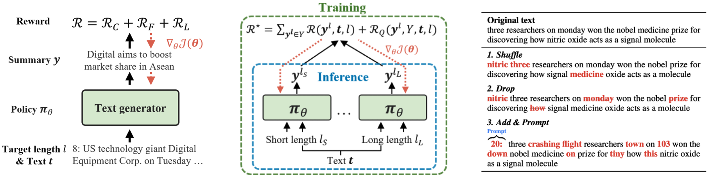
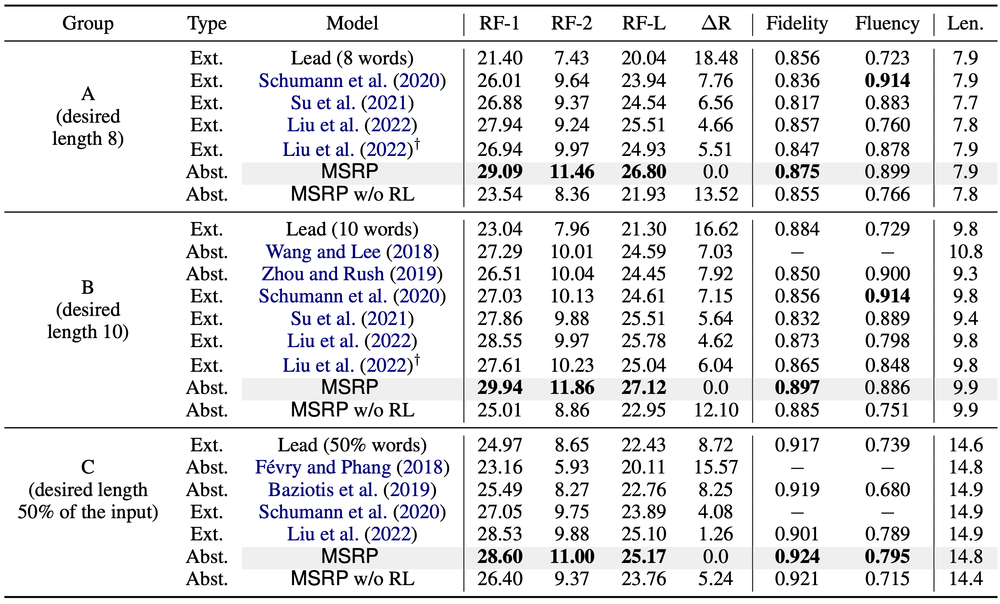
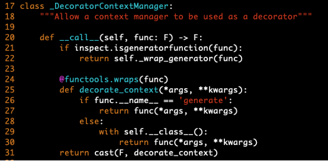

<h1 align="center">
 Generating Multiple-Length Summaries via Reinforcement Learning for Unsupervised Sentence Summarization

</h1>

       
       

Official implementation of 
<a href="https://aclanthology.org/2022.findings-emnlp.214/">EMNLP'22 paper</a>

## Overview

### Unsupervised Summarization

Summarization shortens given texts while maintaining core contents of the texts, and unsupervised approaches have been studied to summarize texts without ground-truth summaries. 

### Reinforcement Learning-based Approach

We devise an **abstractive** model by formulating the summarization task as a reinforcement learning without ground-truth summaries.

### Summary Accuracy

The proposed model (**MSRP**) substantially outperforms both abstractive and extractive models, yet frequently generating new words not contained in input texts.

## Major Requirements

* Python
* Pytorch
* pythonrouge
* transformers
* Numpy

## Evaluation with Trained Models
We uploaded the [trained models](https://huggingface.co/anonsubms) in HuggingFace library so that you can easily evaluate the uploaded models. It will automatically download the trained model and evaluate it on the data.

* anonsubms/msrp_length
* anonsubms/msrp_ratio
* anonsubms/msrp_length_sb
* anonsubms/msrp_ratio_sb

[Example] <pre> <code>python evaulate.py anonsubms/msrp_length</code></pre>
  
## Model training
1. Download the training data from [a public link](https://drive.google.com/open?id=0B6N7tANPyVeBNmlSX19Ld2xDU1E).
	- Move ***train.article.txt*** file to ***data/train/***
    
2. Modify a file of PyTorch (i.e., ***grad_mode.py***) to flow the gradient while generating summaries.
	- This process is required as default code does not allow gradient flow through ***generate*** function used to generate summaries.
	- Highly recommended to make a virtual environment (e.g., Anaconda environment)
    - The file (***grad_mode.py***) can be found in the library path
    - <pre> <code>~/local/anaconda3/envs/ENV_NAME/lib/python3.6/site-packages/torch/autograd/grad_mode.py</code></pre>
	- Modify the code under ***decorate_context*** fnuction by referring ***grad_model_modification.png*** image.
    

    
3. Train MSRP by using the following command line.
	- <pre> <code>python train.py</code></pre>
	- The model will be automatically saved.
	- It will take at least 5 hours on GeForce RTX 3090.
    
4. Evaluate the trained model using ***evaluate.py***.
	- Change the model path from the model ID to the path of the trained model, ***trained_msrp/lb0.01_ap0.3***.
    - <pre> <code>python evaulate.py trained_msrp/lb0.01_ap0.3</code></pre>
    
- You can also perform the pretraining. 
	- <pre> <code>python pretrain_t5.py</code></pre>
	- If you want to use your pretrained model, then change ***init_path*** argument in ***train.py*** to the saved directory ***t5-pretrained/***, and run the MSRP.

## To-do list
- [x] Update how to train
- [ ] Upload outputs
- [ ] Upload evaluation code based on output texts

## Citation
If you use this repository for your work, please consider citing [our paper](https://aclanthology.org/2022.findings-emnlp.214/):

<pre><code>@inproceedings{hyun-etal-2022-generating,
    title = "Generating Multiple-Length Summaries via Reinforcement Learning for Unsupervised Sentence Summarization",
    author = "Hyun, Dongmin  and Wang, Xiting  and Park, Chayoung  and Xie, Xing  and Yu, Hwanjo",
    booktitle = "Findings of the Association for Computational Linguistics: EMNLP 2022",
    month = dec, year = "2022",
    address = "Abu Dhabi, United Arab Emirates",
    publisher = "Association for Computational Linguistics",
    url = "https://aclanthology.org/2022.findings-emnlp.214",
    pages = "2939--2951",
}
</code></pre>

